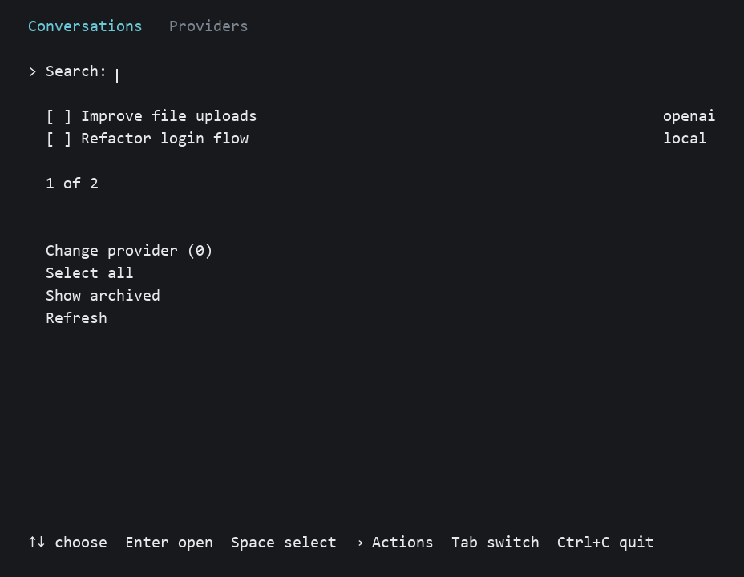
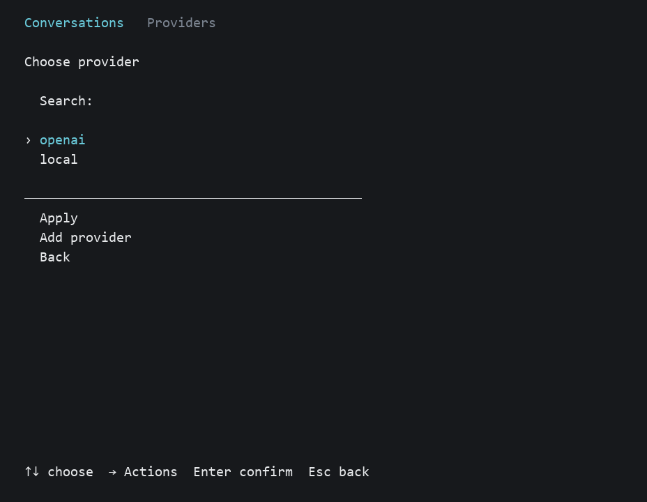

# Codex provider switcher

A terminal user interface (TUI) for switching providers of saved Codex
conversations and forks. Runs on Windows and macOS
(Apple Silicon and Intel).

[Windows EXE](https://github.com/embogomolov/codex-provider-switcher/releases/latest/download/codex-provider-switcher.exe)
· [macOS PKG](https://github.com/embogomolov/codex-provider-switcher/releases/latest/download/codex-provider-switcher-macos-universal.pkg)



## Usage

Close Codex Desktop and CLI before saving changes.

On macOS, start `codex-provider-switcher` in Terminal.

Click conversations, providers and actions with the mouse, or use the keyboard:

1. In Conversations, type part of a name to find it.
2. Choose a result with Up/Down and press Enter. For several conversations,
   mark them with Space and choose Change provider.
3. Choose a provider, then Apply.
4. Reopen Codex when the change finishes.



Each conversation shows its provider. Forks have separate rows marked `Fork` and
can be switched independently. A selection includes its subagents and edited
histories, preserves message content, and leaves unselected conversations and the
default for new conversations on their current providers. Shared history pointers
are kept consistent when referenced files change length.

Tab opens Providers. Choose Add provider and enter a name, a Responses API base
URL and your API key. Use as default selects the provider for new conversations.
`openai` is built in. Adding a provider does not test its connection.

To switch by ID from the command line:

```sh
codex-provider-switcher --apply --select ID --provider openai --yes
```

This command also sets the default provider. Run `--help` for other options.

## Notes

- Checked with Codex `0.153.2` and `0.162.0-alpha.2`. Unsupported history layouts
  are rejected.
- API keys are saved as plain text in Codex `config.toml`. You can choose
  environment-variable authentication or no authentication for a local server.
- After an interrupted change, keep Codex closed and run the switcher again to
  recover. Leave pending files in place. Recovery files are temporary; the
  application does not keep permanent backups.
- To use a different Codex directory, set `CODEX_HOME` or pass `--home PATH`.
- The macOS installer is unsigned and not notarized by Apple.

## Development

Requires Rust 1.96+, MSVC tools on Windows or Xcode command-line tools on macOS.

```sh
cargo build --locked --release
cargo test --locked
```

Distribute the executable from `target/release`.

License: [MIT](LICENSE).
